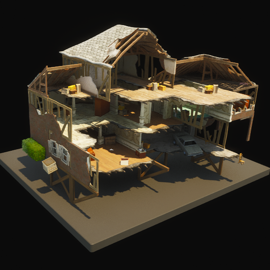
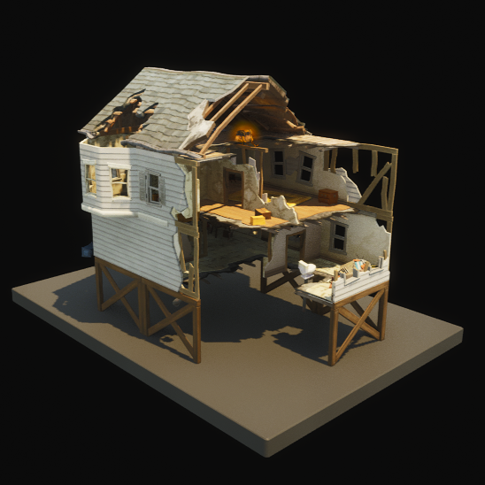
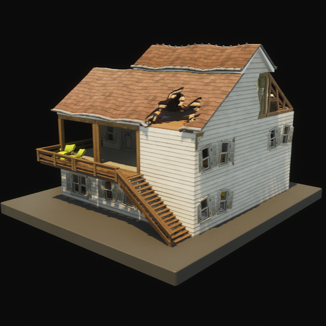

**[Back To Table of Contents](/Table%20of%20Contents.md)**
# Chapter 2 Prefabs

# Sweaty Sands

| Icon | Playset Name w/ Author | Extra Info |
|-----------------------------------------|-----------------|-----------------|
|  | **[Sweaty Sands Hotel 23](SpawnerTexts/Sweaty%20Sands%20Hotel%2023.txt)** **(Ported by: akira_v9)**  **Source: Chapter 2 Island** | Visually Modified: ❌ Requires External Download: ❌|

# Landmarks
| Icon | Playset Name w/ Author | Extra Info |
|-----------------------------------------|-----------------|-----------------|
|  | **[Pristine Point Broken House A](SpawnerTexts/CP_CliffHouse_C_Text.txt)** **(Ported by: akira_v9)**  **Source: Chapter 2 Island** | Visually Modified: ❌ Requires External Download: [DOWNLOAD](https://mega.nz/file/mmxEBTZY#29rYC9MpI3jhrTWZWkGCbOAR3ZLb_LS0IMvuf4-X2Pc) Project Name: Main  Please make sure you follow [this](/README.md#Download-Guide) guide. |
|  | **[Pristine Point Broken House B](SpawnerTexts/CP_CliffHouse_B_Text.txt)** **(Ported by: akira_v9)**  **Source: Chapter 2 Island** | Visually Modified: ❌ Requires External Download: [DOWNLOAD](https://mega.nz/file/fi5EVQIS#NXM1cK1qNP6jGsHwe7v3QZmvRj8_jxuY8CFGbPe4k2I) Project Name: Main  Please make sure you follow [this](/README.md#Download-Guide) guide. |
|  | **[Pristine Point Broken House C](SpawnerTexts/CP_CliffHouse_B_3x3_Text.txt)** **(Ported by: akira_v9)**  **Source: Chapter 2 Island** | Visually Modified: ❌ Requires External Download: [DOWNLOAD](https://mega.nz/file/KihATaYI#uTPZZsAQKpZTUvy8oKlUaTMhEQOTgUBy216D6iNdBwM) Project Name: Main  Please make sure you follow [this](/README.md#Download-Guide) guide. |
