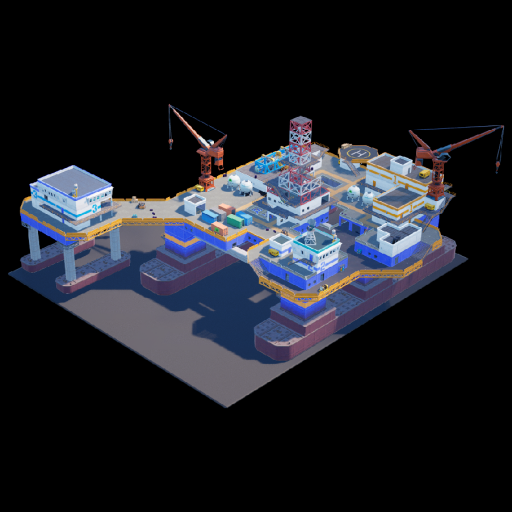
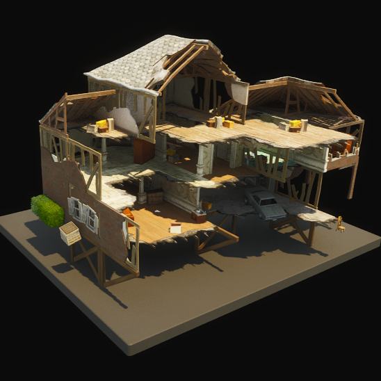
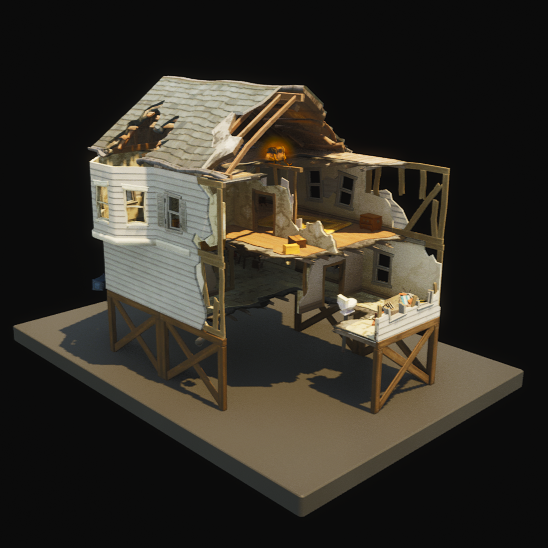
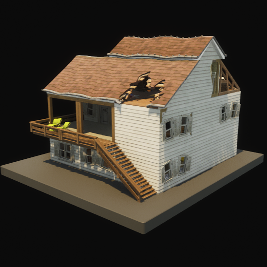
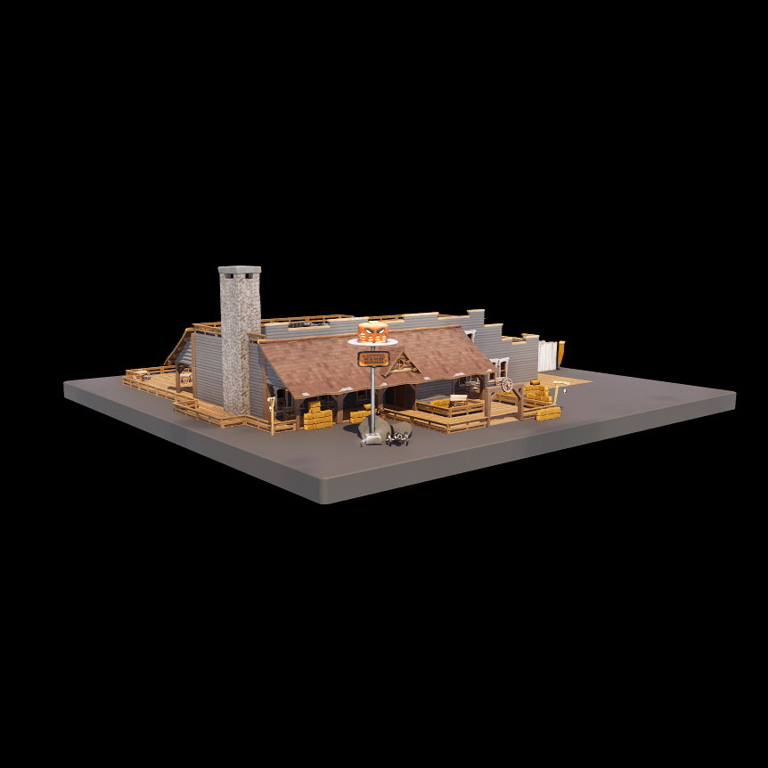
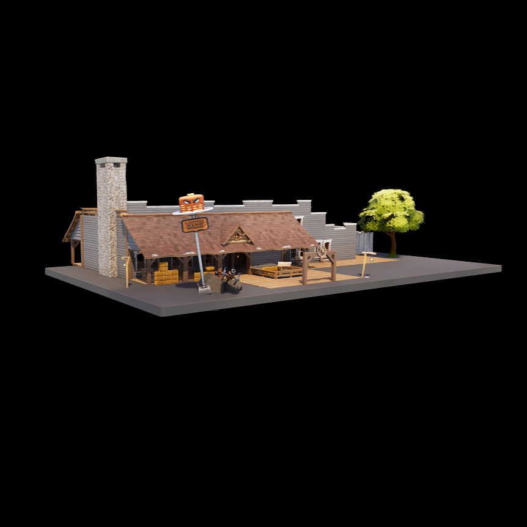
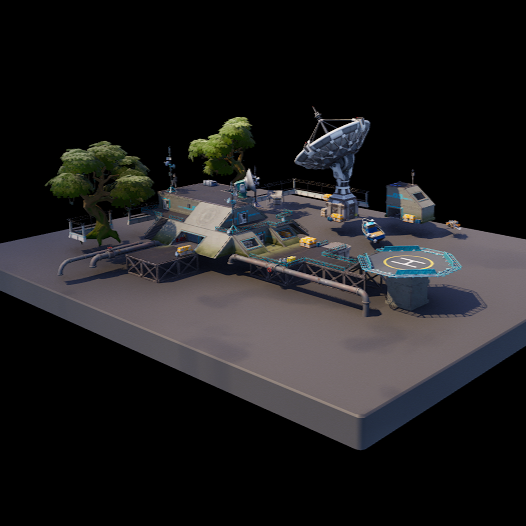
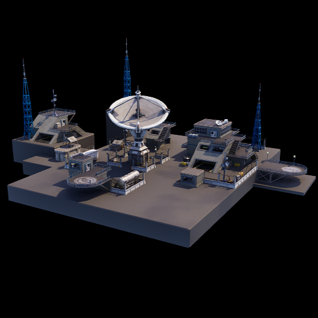

**[Back To Table of Contents](/Table%20of%20Contents.md)**
# Chapter 2 Prefabs

# Sweaty Sands

| Icon | Playset Name w/ Author | Extra Info |
|-----------------------------------------|-----------------|-----------------|
|  | **[Sweaty Sands Hotel 23](SpawnerTexts/Sweaty%20Sands%20Hotel%2023.txt)** **(Ported by: akira_v9)**  **Source: Chapter 2 Island** | Visually Modified: ❌ Requires External Download: ❌|

# Misc Landmarks
| Icon | Playset Name w/ Author | Extra Info |
|-----------------------------------------|-----------------|-----------------|
|  | **[Hydro 16 Pump Station](SpawnerTexts/hydro%2016%20pump%20station.txt)** **(Ported by: Lady Miranda)**  **Source: Chapter 2 Island** | Visually Modified: ❌ Requires External Download: ❌|
|  | **[The Rig](SpawnerTexts/rig.txt)** **(Ported by: Lady Miranda)**  **Source: Chapter 2 Island** | Visually Modified: ✔️ Requires External Download: ❌|
|  | **[Pristine Point Broken House A](SpawnerTexts/CP_CliffHouse_C_Text.txt)** **(Ported by: akira_v9)**  **Source: Chapter 2 Island** | Visually Modified: ❌ Requires External Download: [DOWNLOAD](https://mega.nz/file/Cjh3lQDb#29rYC9MpI3jhrTWZWkGCbOAR3ZLb_LS0IMvuf4-X2Pc) Project Name: Main  Please make sure you follow [this](/README.md#Download-Guide) guide. |
|  | **[Pristine Point Broken House B](SpawnerTexts/CP_CliffHouse_B_Text.txt)** **(Ported by: akira_v9)**  **Source: Chapter 2 Island** | Visually Modified: ❌ Requires External Download: [DOWNLOAD](https://mega.nz/file/Hm5k1Lhb#NXM1cK1qNP6jGsHwe7v3QZmvRj8_jxuY8CFGbPe4k2I) Project Name: Main  Please make sure you follow [this](/README.md#Download-Guide) guide. |
|  | **[Pristine Point Broken House C](SpawnerTexts/CP_CliffHouse_B_3x3_Text.txt)** **(Ported by: akira_v9)**  **Source: Chapter 2 Island** | Visually Modified: ❌ Requires External Download: [DOWNLOAD](https://mega.nz/file/H3YS3YAB#uTPZZsAQKpZTUvy8oKlUaTMhEQOTgUBy216D6iNdBwM) Project Name: Main  Please make sure you follow [this](/README.md#Download-Guide) guide. |
|  | **[Butter Barn](SpawnerTexts/PP_ButterBarnOriginal.txt)** **(Ported by: akira_v9)**  **Source: Chapter 2 Island** | Visually Modified: ❌ Requires External Download: [DOWNLOAD](https://mega.nz/file/XuRBAIpQ#puBRRlKa95vydRUcNVZN5zGaWFAgdhXQwZU9ky0TKxk) Project Name: Main  Please make sure you follow [this](/README.md#Download-Guide) guide. |
|  | **[Butter Barn (Abducted)](SpawnerTexts/PP_ButterBarnMother.txt)** **(Ported by: akira_v9)**  **Source: Alien Mothership** | Visually Modified: ❌ Requires External Download: [DOWNLOAD](https://mega.nz/file/XuRBAIpQ#puBRRlKa95vydRUcNVZN5zGaWFAgdhXQwZU9ky0TKxk) Project Name: Main  Please make sure you follow [this](/README.md#Download-Guide) guide. |

# Full Landmarks

| Icon | Playset Name w/ Author | Extra Info |
|-----------------------------------------|-----------------|-----------------|
|  | **[IO Base 03](SpawnerTexts/POI_RadarDish_03.txt)** **(Ported by: akira_v9)**  **Source: Chapter 2 Island** | Visually Modified: ❌ Requires External Download: [DOWNLOAD](https://mega.nz/file/myhTBZqQ#LIEXxjdc9LKApgK7YAk4GIFDxtKy8Be4fCpnefSFXP4) Project Name: TinfoilUEFN  Please make sure you follow [this](/README.md#Download-Guide) guide. |
|  | **[IO Base 04](SpawnerTexts/POI_RadarDish_04.txt)** **(Ported by: akira_v9)**  **Source: Chapter 2 Island** | Visually Modified: ❌ Requires External Download: [DOWNLOAD](https://mega.nz/file/brZhTBoY#0twXOzBF-6Tavn8ft61_nK_drN_SpK4uo1Azv4c7UcY) Project Name: TinfoilUEFN  Please make sure you follow [this](/README.md#Download-Guide) guide. |