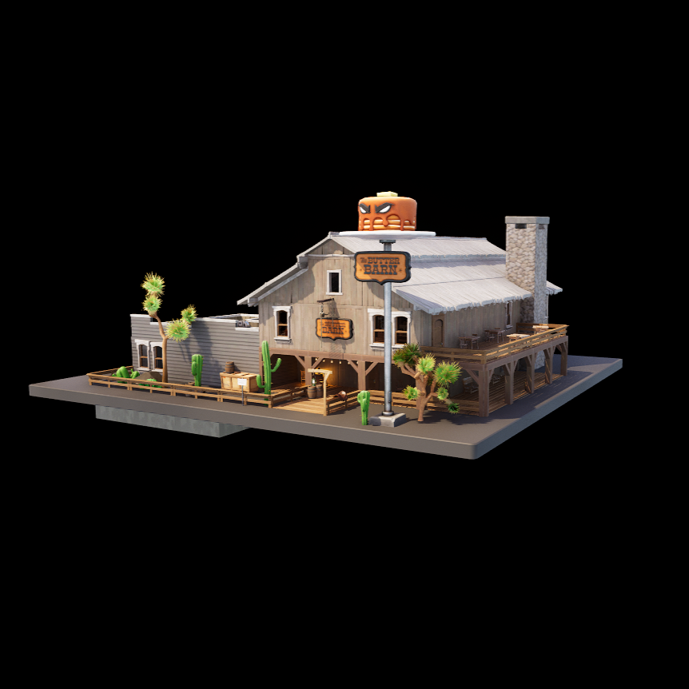

**[Back To Table of Contents](/Table%20of%20Contents.md)**
# Squid Grounds Prefabs

# Misc Landmarks

| Icon | Playset Name w/ Author | Extra Info |
|  | **[Butter Barn (Squid Grounds Modification)](SpawnerTexts/PP_ButterBarnTimberStake_NOIP.txt)** **(Ported by: akira_v9)**  **Source: Reload Squid Grounds Island** | Visually Modified: ✔️ Requires External Download: [DOWNLOAD](https://mega.nz/file/XuRBAIpQ#puBRRlKa95vydRUcNVZN5zGaWFAgdhXQwZU9ky0TKxk) Project Name: ApolloUEFN  Please make sure you follow [this](/README.md#Download-Guide) guide. |
|  | **[Butter Barn (Squid Grounds Modification V1)](SpawnerTexts/PP_ButterBarnTimberStakeV1.txt)** **(Ported by: akira_v9)**  **Source: Game Files** | Visually Modified: ❌ Requires External Download: [DOWNLOAD](https://mega.nz/file/XuRBAIpQ#puBRRlKa95vydRUcNVZN5zGaWFAgdhXQwZU9ky0TKxk) Project Name: ApolloUEFN  Please make sure you follow [this](/README.md#Download-Guide) guide. |